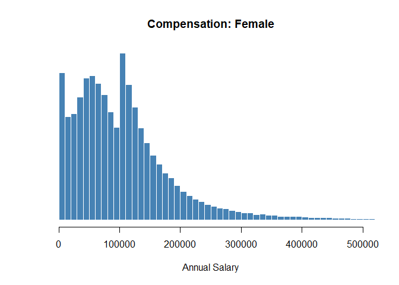
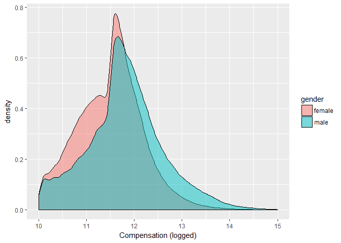
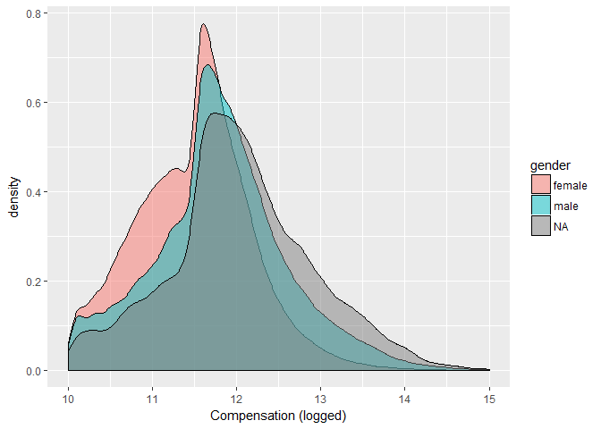

# Coding Gender
Jesse Lecy  


# Load Compensation Data

This data was generated from Part II of [Schedule J](https://www.irs.gov/pub/irs-pdf/f990sj.pdf) on the IRS 990 2014 E-Files.


```r
data.url <- "https://github.com/lecy/coding-gender-of-nonprofit-leaders/raw/master/DATA/CompDat-2014.rds"

dat <- readRDS( gzcon( url( data.url )))

names( dat )
```

```
##  [1] "FilingId"    "FilerEIN"    "TaxYr"       "Amended"     "FilerName1" 
##  [6] "FilerName2"  "PdBeginDt"   "PdEndDt"     "Org501c3"    "Org501cInd" 
## [11] "Org501cType" "Org4947a1"   "Org527Ind"   "FormYr"      "PersonNm"   
## [16] "TitleTxt"    "AvgHrs"      "AvgHrsRltd"  "TrustOrDir"  "Officer"    
## [21] "KeyEmpl"     "HighComp"    "FmrOfficer"  "RptCmpOrg"   "RptCmpRltd" 
## [26] "OtherComp"
```

```r
head( dat )
```

```
##     FilingId  FilerEIN TaxYr Amended               FilerName1 FilerName2
## 89    549205 850391813  2014       0 IHS RECOVERY PROGRAM INC       <NA>
## 90    549205 850391813  2014       0 IHS RECOVERY PROGRAM INC       <NA>
## 91    549205 850391813  2014       0 IHS RECOVERY PROGRAM INC       <NA>
## 92    549205 850391813  2014       0 IHS RECOVERY PROGRAM INC       <NA>
## 93    549205 850391813  2014       0 IHS RECOVERY PROGRAM INC       <NA>
## 139   713167 520714250  2014       0  Petty Officers Mess Inc       <NA>
##      PdBeginDt    PdEndDt Org501c3 Org501cInd Org501cType Org4947a1
## 89  2014-01-01 2014-12-31        1          0          NA         0
## 90  2014-01-01 2014-12-31        1          0          NA         0
## 91  2014-01-01 2014-12-31        1          0          NA         0
## 92  2014-01-01 2014-12-31        1          0          NA         0
## 93  2014-01-01 2014-12-31        1          0          NA         0
## 139 2014-01-01 2014-12-31        0          1           7         0
##     Org527Ind FormYr               PersonNm       TitleTxt AvgHrs
## 89          0   1994         BRIAN PARKHILL  Pres/Exec Dir     40
## 90          0   1994           SANDY SZABAT Vice President      1
## 91          0   1994             BUD WATSON      Secretary      1
## 92          0   1994          CLINT SINGLEY      Treasurer      1
## 93          0   1994           PAT TRUJILLO       Director      1
## 139         0   2013 LCDR Ronald McCampbell      President     40
##     AvgHrsRltd TrustOrDir Officer KeyEmpl HighComp FmrOfficer RptCmpOrg
## 89           0          1       1       0        0          0     95380
## 90           0          1       1       0        0          0         0
## 91           0          1       1       0        0          0         0
## 92           0          1       1       0        0          0         0
## 93           0          1       0       0        0          0         0
## 139          0          0       1       0        0          0         0
##     RptCmpRltd OtherComp
## 89           0         0
## 90           0         0
## 91           0         0
## 92           0         0
## 93           0         0
## 139          0         0
```


# Cleaning Names

There are no clear IRS formatting guidelines for submitting unstructured data like names and organizational role. As a result, this data can be fairly messy.

Here are some examples of using string processing functions in R to clean up some common problems with the data.


```r
dat$PersonNm <- toupper( dat$PersonNm )

nm <- dat$PersonNm

head( nm, 100 )
```

```
##   [1] "BRIAN PARKHILL"             "SANDY SZABAT"              
##   [3] "BUD WATSON"                 "CLINT SINGLEY"             
##   [5] "PAT TRUJILLO"               "LCDR RONALD MCCAMPBELL"    
##   [7] "EN1 NATHAN ARMENDARIZ"      "SH2 KIM MORRISON"          
##   [9] "SH1 SAMUEL HERNANDEZMORENO" "VINCENT BENIGNI"           
##  [11] "BETSY RUETTIGER"            "JAMES HARVEY"              
##  [13] "PAUL LEBER"                 "JD ROSS"                   
##  [15] "JOHN SHERIDAN"              "BENJAMIN T STORTZ"         
##  [17] "JAMES WIGGINS"              "LOUIS VESCIO"              
##  [19] "MANUEL GALVAN"              "MICHELLE MORGAN"           
##  [21] "JILL OLIVER"                "HEATHER EHRHART"           
##  [23] "ELAINE SAMPLE"              "MERCEDES FLEISCHMAN"       
##  [25] "DONNA JOHNSON"              "KARYN PEREZ"               
##  [27] "JILL WEINLEIN"              "MINDY DIPAOLO"             
##  [29] "ROSE PARK"                  "JENNY KIM"                 
##  [31] "KELLY ARMALY"               "JENNIFER SUH"              
##  [33] "ALEEN LANGTON"              "JAMIE HARGATHER"           
##  [35] "LINDSAY TARQUINIO"          "GAVIN TARQUINIO"           
##  [37] "TIM BAILEY"                 "CHRIS REIS"                
##  [39] "ERIN LINK"                  "PATRICK CHAFFIN"           
##  [41] "CHRIS WAND"                 "CHRISTINE SCHIESL"         
##  [43] "JEANNE QUANN"               "CHRIS EVEN"                
##  [45] "TOM BENDA JR"               "TIM CONLON"                
##  [47] "BARB HEITZMAN"              "DR RANDY LENGELING"        
##  [49] "TOM PECKOSH"                "EDWIN E RITTS JR"          
##  [51] "JULIE STEFFEN"              "MIKE STOLL"                
##  [53] "JACK WERTZBERGER"           "MARK WAHLERT"              
##  [55] "SUE ROGACS"                 "RICH BENACCI"              
##  [57] "ROBERT BOEHNER"             "JACOB DVORAK"              
##  [59] "CINDY REARICK"              "HELEN GOHSLER"             
##  [61] "DOUGLAS BRAENDEL"           "GERALD SEKERAK"            
##  [63] "DENISE THOMAS WILCOX"       "TIM BRODERICK"             
##  [65] "SHARI LEWIS"                "MICHAEL CICCOCIOPPO"       
##  [67] "ANDREW BARANOWSKI"          "LAWRENCE BRADBURY"         
##  [69] "DAVE BRINK"                 "ANDREW DUGUID"             
##  [71] "JOHN GARDINER"              "SHELLY HENRY"              
##  [73] "BRIAN IUDICA"               "WILLIAM KLEIN"             
##  [75] "JIMMIE MCGRUDER"            "CHRISTOPHER MILLER"        
##  [77] "JOHN PALERMO"               "RICHARD PATIRI"            
##  [79] "JORDAN REED"                "MICHAEL SASUK"             
##  [81] "PETER SAYEVICH"             "ERIC SCHUMAN"              
##  [83] "JAMES VACCARO"              "JULIAN WELLINGTON"         
##  [85] "MARK ZIEGLER"               "SCOTT GLENN"               
##  [87] "RICHARD KROEBEL"            "JAMES TRACEY"              
##  [89] "BARBARA BENDER"             "ROB DEL MORO"              
##  [91] "JOHN CURRY"                 "MICHAEL CLEMENT"           
##  [93] "ED MOYER"                   "PAUL VALERIO"              
##  [95] "JIM MUIR"                   "JOHN NELSON"               
##  [97] "MARK SANCHEZ"               "TOM HARRIGAN"              
##  [99] "JOSEPH MASHER"              "JOSHUA M BIALEK"
```

```r
nm <- gsub( "SR ", "", nm, ignore.case=FALSE )
nm <- gsub( "DR ", "", nm, ignore.case=FALSE )
nm <- gsub( "REV ", "", nm, ignore.case=FALSE )
nm <- gsub( "MR ", "", nm, ignore.case=FALSE )
nm <- gsub( "SISTER ", "", nm, ignore.case=FALSE )
nm <- gsub( "REVEREND ", "", nm, ignore.case=FALSE )
nm <- gsub( "PROF ", "", nm, ignore.case=FALSE )
nm <- gsub( "RABBI ", "", nm, ignore.case=FALSE )
nm <- gsub( "^.{1} ", "", nm ) # remove numbers at the beginning of names
nm <- gsub( "^.{1} ", "", nm )
nm <- gsub( "[0-9]", "", nm ) # remove all numbers from names
nm <- gsub( "^ ", "", nm ) # remove spaces at the beginning of names
nm <- gsub( "^ ", "", nm )

nm[ nm == "" ] <- NA  # remove empty name elements
```


# Split Full Names Into Parts

In order to use the **gender** package in R, we need to isolate first names. We do this by splitting the full name into individual components, then retaining the first name in the list.

In some cases this approach will fail. For example, if the names are listed in reverse order:

Smith, John

Or perhaps a person uses a title or an abbreviated first name:

Senator Smith

JW Smith


```r
x <- strsplit( nm, " " )

first.names <- unlist( lapply( x, `[[`, 1 ) )

head( first.names, 100 )
```

```
##   [1] "BRIAN"       "SANDY"       "BUD"         "CLINT"       "PAT"        
##   [6] "LCRONALD"    "EN"          "SH"          "SH"          "VINCENT"    
##  [11] "BETSY"       "JAMES"       "PAUL"        "JD"          "JOHN"       
##  [16] "BENJAMIN"    "JAMES"       "LOUIS"       "MANUEL"      "MICHELLE"   
##  [21] "JILL"        "HEATHER"     "ELAINE"      "MERCEDES"    "DONNA"      
##  [26] "KARYN"       "JILL"        "MINDY"       "ROSE"        "JENNY"      
##  [31] "KELLY"       "JENNIFER"    "ALEEN"       "JAMIE"       "LINDSAY"    
##  [36] "GAVIN"       "TIM"         "CHRIS"       "ERIN"        "PATRICK"    
##  [41] "CHRIS"       "CHRISTINE"   "JEANNE"      "CHRIS"       "TOM"        
##  [46] "TIM"         "BARB"        "RANDY"       "TOM"         "EDWIN"      
##  [51] "JULIE"       "MIKE"        "JACK"        "MARK"        "SUE"        
##  [56] "RICH"        "ROBERT"      "JACOB"       "CINDY"       "HELEN"      
##  [61] "DOUGLAS"     "GERALD"      "DENISE"      "TIM"         "SHARI"      
##  [66] "MICHAEL"     "ANDREW"      "LAWRENCE"    "DAVE"        "ANDREW"     
##  [71] "JOHN"        "SHELLY"      "BRIAN"       "WILLIAM"     "JIMMIE"     
##  [76] "CHRISTOPHER" "JOHN"        "RICHARD"     "JORDAN"      "MICHAEL"    
##  [81] "PETER"       "ERIC"        "JAMES"       "JULIAN"      "MARK"       
##  [86] "SCOTT"       "RICHARD"     "JAMES"       "BARBARA"     "ROB"        
##  [91] "JOHN"        "MICHAEL"     "ED"          "PAUL"        "JIM"        
##  [96] "JOHN"        "MARK"        "TOM"         "JOSEPH"      "JOSHUA"
```

```r
dat$FirstName <- tolower( first.names )

fn <- unique( tolower( first.names ) )

length( fn ) # number of unique first names
```

```
## [1] 78287
```


# Coding Gender


## The Gender Package in R

### Usage


```r
gender(names, years = c(1932, 2012), method = c("ssa", "ipums", "napp",
  "kantrowitz", "genderize", "demo"), countries = c("United States", "Canada",
  "United Kingdom", "Germany", "Iceland", "Norway", "Sweden"))
```


### Description

This function predicts the gender of a first name given a year or range of years in which the person was born. The prediction can use one of several data sets suitable for different time periods or geographical regions. See the package vignette for suggestions on using this function with multiple names and for a discussion of which data set is most suitable for your research question. When using certains methods, the genderdata data package is required; you will be prompted to install it if it is not already available.


### Arguments

**names**

First names as a character vector. Names are case insensitive.

**years**

The birth year of the name whose gender is to be predicted. This argument can be either a single year, a range of years in the form c(1880, 1900). If no value is specified, then for the "ssa" method it will use the period 1932 to 2012; acceptable years for the SSA method range from 1880 to 2012, but for years before 1930 the IPUMS method is probably more accurate. For the "ipums" method the default range is the period 1789 to 1930, which is also the range of acceptable years. For the "napp" method the default range is the period 1758 to 1910, which is also the range of acceptable years. If a year or range of years is specified, then the names will be looked up for that period.

**method**

This value determines the data set that is used to predict the gender of the name. The "ssa" method looks up names based from the U.S. Social Security Administration baby name data. (This method is based on an implementation by Cameron Blevins.) The "ipums" method looks up names from the U.S. Census data in the Integrated Public Use Microdata Series. (This method was contributed by Ben Schmidt.) The "kantrowitz" method uses the Kantrowitz corpus of male and female names. The "genderize" method uses the Genderize.io <http://genderize.io/> API, which is based on "user profiles across major social networks." The "demo" method is uses the top 100 names in the SSA method; it is provided only for demonstration purposes when the genderdata package is not installed and it is not suitable for research purposes.

**countries**

The countries for which datasets are being used. For the "ssa" and "ipums" methods, the only valid option is "United States" which will be assumed if no argument is specified. For the "napp" method, you may specify a character vector with any of the following countries: "Canada", "United Kingdom", "Germany", "Iceland", "Norway", "Sweden". For the "kantrowitz" and "genderize" methods, no country should be specified.


# Example

### Load Some Data


```r
first.names <- c("dave", "glen", "beverly", "jennifer", "stacy", "lynn", "betty", 
"linda", "laurie", "marilyn", "michelle", "cara", "allison", 
"alan", "jerry", "bo", "paul", "jim", "jeff", "chuck", "henry", 
NA, "steve", "saddiq", "kim")
```

### Categorize Names


```r
# install.packages( "gender" )

library( gender )

example.results <- gender(  first.names )

# when first installing, you will be asked to build a local database of names
# > gen <- gender( fn, method="ssa" )
# Install the genderdata package? 
# 
# 1: Yes
# 2: No
# Selection:  <- TYPE "Yes"

print( example.results, n=10 )
```

```
## # A tibble: 24 x 6
##       name proportion_male proportion_female gender year_min year_max
##      <chr>           <dbl>             <dbl>  <chr>    <dbl>    <dbl>
##  1    alan          0.9968            0.0032   male     1932     2012
##  2 allison          0.0082            0.9918 female     1932     2012
##  3   betty          0.0039            0.9961 female     1932     2012
##  4 beverly          0.0070            0.9930 female     1932     2012
##  5      bo          0.9348            0.0652   male     1932     2012
##  6    cara          0.0012            0.9988 female     1932     2012
##  7   chuck          0.9997            0.0003   male     1932     2012
##  8    dave          0.9985            0.0015   male     1932     2012
##  9    glen          0.9918            0.0082   male     1932     2012
## 10   henry          0.9935            0.0065   male     1932     2012
## # ... with 14 more rows
```


## Code Names from Compensation Data


```r
gen <- gender( fn, method="ssa" )

# Additional Available Methods
# gen <- gender( fn, method="ipums" )
# gen <- gender( fn, method="kantrowitz" ) 


print( gen, n=10 )
```

```
## # A tibble: 30,274 x 6
##       name proportion_male proportion_female gender year_min year_max
##      <chr>           <dbl>             <dbl>  <chr>    <dbl>    <dbl>
##  1  aakash          1.0000            0.0000   male     1932     2012
##  2   aalap          1.0000            0.0000   male     1932     2012
##  3  aaleah          0.0000            1.0000 female     1932     2012
##  4 aaliyah          0.0011            0.9989 female     1932     2012
##  5   aamer          1.0000            0.0000   male     1932     2012
##  6   aamir          1.0000            0.0000   male     1932     2012
##  7   aamna          0.0000            1.0000 female     1932     2012
##  8    aana          0.0000            1.0000 female     1932     2012
##  9    aara          0.0000            1.0000 female     1932     2012
## 10   aaren          0.6915            0.3085   male     1932     2012
## # ... with 3.026e+04 more rows
```


You can add gender to the original dataset by merging results:


```r
gen <- gen[ , 1:4 ]

dat <- merge( dat, gen, by.x="FirstName", by.y="name", all.x=T )

table( dat$gender, useNA="ifany" )
```

```
## 
##  either  female    male    <NA> 
##      15  967627 1580613  129031
```


# Failed Matches

Since the R package assigns gender based upon matches to the Social Security database of birth certificates, names that do not appear in the database (or appear too few times and thus are not reported by the SSA for privacy reasons) cannot be properly coded.


```r
# NAMES THAT DO NOT RECEIVE A CLEAR GENDER CODE

ambiguous.cases <- dat$gender == "either"
ambiguous.cases[ is.na(ambiguous.cases)] <- FALSE

dat$PersonNm[ ambiguous.cases ]
```

```
##  [1] "LUGENE POWELL"    "LUGENE INZANA"    "LUGENE POWELL"   
##  [4] "LUGENE LOGAN"     "LUGENE INZANA"    "LUGENE INZANA"   
##  [7] "LUGENE INZANA"    "LUGENE INZANA"    "LUGENE GARRETT"  
## [10] "LUGENE INZANA"    "LUGENE POWELL"    "LUGENE INZANA"   
## [13] "LUGENE VINCENT"   "LUGENE INZANA"    "LUGENE CALDERONE"
```

```r
# ONLY ONE NAME HAS EXACTLY 50-50 SPLIT:  LUGENE!


# NAMES NOT FOUND

no.gender <- dat$PersonNm[ is.na(dat$gender) ]

head( no.gender, 10 )
```

```
##  [1] "'"                       "'ANAPESI KA'ILI"        
##  [3] "J 'BEN' WARREN"          "C W 'BILL' ENGLUND JR"  
##  [5] "'D'JUANA MILLER"         "'IOKEPA DESANTOS"       
##  [7] "L 'JACK' WONG"           "'LAINE HEATHCOTE"       
##  [9] "W R 'ROSS' BRIGDEN"      "'VARIOUS' INDIVIDUALS 8"
```


# Comparing Compensation by Gender


```r
library( dplyr )

options( scipen=8 )

dat$gender[ dat$gender == "either" ] <- NA

d2 <- dat[ dat$AvgHrs > 1 & dat$RptCmpOrg > 1 & dat$Org501c3 == 1 , ]


summary( d2$RptCmpOrg[ d2$gender == "male" ] )
```

```
##     Min.  1st Qu.   Median     Mean  3rd Qu.     Max.     NA's 
##        5    63326   122536   182771   206786 10403329    30359
```

```r
hist( d2$RptCmpOrg[ d2$gender == "male" ], xlim=c(0,500000), 
      breaks=seq(0,max(d2$RptCmpOrg,na.rm=T),10000), 
      col="steelblue", border="white", yaxt="n", 
      ylab="", xlab="Annual Salary", main="Compensation: Male" )
```

<!-- -->

```r
summary( d2$RptCmpOrg[ d2$gender == "female" ] )
```

```
##     Min.  1st Qu.   Median     Mean  3rd Qu.     Max.     NA's 
##        2    47464    92700   112647   140781 13757369    30359
```

```r
hist( d2$RptCmpOrg[ d2$gender == "female" ], xlim=c(0,500000), 
      breaks=seq(0,max(d2$RptCmpOrg,na.rm=T),10000), 
      col="steelblue", border="white", yaxt="n", 
      ylab="", xlab="Annual Salary", main="Compensation: Female" )
```

<!-- -->

```r
# people with pay over $8 million

filter( dat, RptCmpOrg > 8000000 )
```

```
##    FirstName FilingId  FilerEIN TaxYr Amended
## 1     andrew  1314648 237361259  2014       0
## 2     andrew   577306 136171197  2014       0
## 3        bjc   802442 431617558  2014       0
## 4     daniel   133140 351955872  2014       0
## 5     daniel  1314648 237361259  2014       0
## 6     george   275041 941340523  2014       0
## 7       jane  1314648 237361259  2014       0
## 8      javon   926239 390816848  2014       0
## 9    michael   565695 112965586  2014       0
## 10      park   195023 363465840  2014       0
## 11   patrick   638919 941461312  2014       0
## 12     paula  1345812 581357177  2014       0
## 13     roger  1025540 131922622  2014       0
## 14       see   619366 381350130  2014       0
## 15   stephen  1314648 237361259  2014       0
## 16    thomas  1329123 231352685  2014       0
## 17    thomas   980783 231352685  2014       0
## 18    thomas   991917 232589322  2014       0
## 19    victor  1247917 560532129  2014       0
## 20      <NA>  1081868 453358926  2014       0
##                                          FilerName1 FilerName2  PdBeginDt
## 1                    HARVARD MANAGEMENT COMPANY INC       <NA> 2014-07-01
## 2           ICAHN SCHOOL OF MEDICINE AT MOUNT SINAI       <NA> 2014-01-01
## 3                                 BJC HEALTH SYSTEM       <NA> 2014-01-01
## 4                     INDIANA UNIVERSITY HEALTH INC       <NA> 2014-01-01
## 5                    HARVARD MANAGEMENT COMPANY INC       <NA> 2014-07-01
## 6                 KAISER FOUNDATION HEALTH PLAN INC       <NA> 2014-01-01
## 7                    HARVARD MANAGEMENT COMPANY INC       <NA> 2014-07-01
## 8                   MERCY HEALTH SYSTEM CORPORATION       <NA> 2014-07-01
## 9        NORTH SHORE-LONG ISLAND JEWISH HEALTH CARE       <NA> 2014-01-01
## 10                    PARK NICOLLET HEALTH SERVICES       <NA> 2014-01-01
## 11                       DELTA DENTAL OF CALIFORNIA       <NA> 2014-01-01
## 12           SAVANNAH COLLEGE OF ART AND DESIGN INC       <NA> 2014-07-01
## 13                         National Football League       <NA> 2014-04-01
## 14 CREDIT UNIONS CHARTERED IN THE STATE OF MICHIGAN       <NA> 2014-01-01
## 15                   HARVARD MANAGEMENT COMPANY INC       <NA> 2014-07-01
## 16       TRUSTEES OF THE UNIVERSITY OF PENNSYLVANIA       <NA> 2014-07-01
## 17       Trustees of the University of Pennsylvania       <NA> 2014-07-01
## 18               Children's Surgical Associates Ltd       <NA> 2014-07-01
## 19                                  DUKE UNIVERSITY       <NA> 2014-07-01
## 20                        Ascension Health Alliance       <NA> 2014-07-01
##       PdEndDt Org501c3 Org501cInd Org501cType Org4947a1 Org527Ind FormYr
## 1  2015-06-30        1          0          NA         0         0   1974
## 2  2014-12-31        1          0          NA         0         0   1964
## 3  2014-12-31        1          0          NA         0         0   1993
## 4  2014-12-31        1          0          NA         0         0   1995
## 5  2015-06-30        1          0          NA         0         0   1974
## 6  2014-12-31        1          0          NA         0         0   1955
## 7  2015-06-30        1          0          NA         0         0   1974
## 8  2015-06-30        1          0          NA         0         0   1972
## 9  2014-12-31        1          0          NA         0         0   1990
## 10 2014-12-31        1          0          NA         0         0   1986
## 11 2014-12-31        0          1           4         0         0   1954
## 12 2015-06-30        1          0          NA         0         0   1978
## 13 2015-03-31        0          1           6         0         0   1920
## 14 2014-12-31        0          1          14         0         0   1936
## 15 2015-06-30        1          0          NA         0         0   1974
## 16 2015-06-30        1          0          NA         0         0     NA
## 17 2015-06-30        1          0          NA         0         0     NA
## 18 2015-06-30        1          0          NA         0         0   1990
## 19 2015-06-30        1          0          NA         0         0     NA
## 20 2015-06-30        1          0          NA         0         0   2011
##                               PersonNm
## 1                   ANDREW G WILTSHIRE
## 2                      ANDREW HECHT MD
## 3          BJC HEALTH SYS GROUP RETURN
## 4                    DANIEL F EVANS JR
## 5                      DANIEL CUMMINGS
## 6                   GEORGE C HALVORSON
## 7                      JANE L MENDILLO
## 8                            JAVON BEA
## 9                    MICHAEL J DOWLING
## 10 PARK NICOLLET GROUP RETURN -SEE SCH
## 11                    PATRICK S STEELE
## 12                     PAULA S WALLACE
## 13                       ROGER GOODELL
## 14    SEE SCH J PART III EMPLOYEE LIST
## 15                     STEPHEN J BLYTH
## 16                   THOMAS L SPRAY MD
## 17                   THOMAS L SPRAY MD
## 18                   THOMAS L SPRAY MD
## 19                       VICTOR J DZAU
## 20                                <NA>
##                                              TitleTxt AvgHrs AvgHrsRltd
## 1                            MD - HEAD OF ALT. ASSETS     60         NA
## 2                                               CHIEF     55          0
## 3                                      SEE SCHEDULE O     40         NA
## 4                            DIRECTOR/PRESIDENT & CEO     61          0
## 5                                    MD - REAL ESTATE     60         NA
## 6                                            Chairman      0          0
## 7                MD - PRESIDENT & CEO(UNTIL 12/31/14)     50         10
## 8                                PRESIDENT & DIRECTOR     55         NA
## 9                                     PRESIDENT & CEO     50          0
## 10                                           OFFICERS     55         NA
## 11                                            EVP/CIO     40         10
## 12                                          PRESIDENT     60          1
## 13                                       Commissioner     40          0
## 14 Required Employees (detail available upon request)     40          0
## 15                 MD - PRESIDENT & CEO(AS OF 1/1/15)     50         10
## 16                                     CHOP - SURGERY     40          0
## 17                                       CHOP SURGERY     40          0
## 18                                     ASST SECRETARY     40          2
## 19                                     FORMER OFFICER     40         48
## 20                                      PRESIDENT/CEO     50          0
##    TrustOrDir Officer KeyEmpl HighComp FmrOfficer RptCmpOrg RptCmpRltd
## 1           0       0       1        0          0  10403329          0
## 2           0       0       0        1          0   9870914          0
## 3           1       1       0        0          0  14465349          0
## 4           1       1       0        0          0   8074963          0
## 5           0       0       0        1          0   8668164          0
## 6           0       0       0        0          1  10399970          0
## 7           1       1       0        0          0  13757369          0
## 8           1       1       0        0          0   8005192          0
## 9           1       1       0        0          0   9627815          0
## 10          0       1       0        0          0   9840740    3339820
## 11          0       1       0        0          0  11166136          0
## 12          0       1       0        0          0   9409076          0
## 13          0       1       0        0          0  30273000          0
## 14          0       1       0        0          0   9068821          0
## 15          1       1       0        0          0   8292303         12
## 16          0       0       0        1          0   8341335          0
## 17          0       0       0        1          0   8341335          0
## 18          0       1       0        0          0   8341335          0
## 19          0       0       0        0          1   8001393          0
## 20          1       1       0        0          0  17491695          0
##    OtherComp proportion_male proportion_female gender
## 1      51458          0.9960            0.0040   male
## 2      45988          0.9960            0.0040   male
## 3    1918008              NA                NA   <NA>
## 4      31654          0.9954            0.0046   male
## 5      53901          0.9954            0.0046   male
## 6      46427          0.9932            0.0068   male
## 7      55282          0.0029            0.9971 female
## 8      38785          0.9490            0.0510   male
## 9     477742          0.9947            0.0053   male
## 10   1787168          1.0000            0.0000   male
## 11   2441976          0.9955            0.0045   male
## 12    212636          0.0030            0.9970 female
## 13   3792000          0.9962            0.0038   male
## 14    451434          0.0000            1.0000 female
## 15     53791          0.9964            0.0036   male
## 16     35095          0.9964            0.0036   male
## 17     35095          0.9964            0.0036   male
## 18    533311          0.9964            0.0036   male
## 19     39007          0.9939            0.0061   male
## 20     73857              NA                NA   <NA>
```

```r
t.test( dat$RptCmpOrg ~ dat$gender )
```

```
## 
## 	Welch Two Sample t-test
## 
## data:  dat$RptCmpOrg by dat$gender
## t = -28.424, df = 2510100, p-value < 2.2e-16
## alternative hypothesis: true difference in means is not equal to 0
## 95 percent confidence interval:
##  -2990.719 -2604.876
## sample estimates:
## mean in group female   mean in group male 
##             14118.98             16916.78
```


### Comparing Density Plots


```r
library(ggplot2)


ggplot( dat[!is.na(dat$gender),], aes( x=log(RptCmpOrg), fill=gender )) + 
        geom_density(alpha = 0.5) + xlim(10,15) +
        xlab( "Compensation (logged)" )
```

<!-- -->

```r
ggplot( dat, aes( x=log(RptCmpOrg), fill=gender )) + 
        geom_density(alpha = 0.5) + xlim(10,15) +
        xlab( "Compensation (logged)" )
```

<!-- -->


# Coding Titles

The IRS forms (Schedule J) contain information about all leaders, board members, and highly-compensated individuals in the nonprofit organizations. We often want to isolate one of these groups. For example, perhaps we want to look at only CEOs or CFOs.

Unfortunately the titles are also not standardized. But we can apply some similar string processing techinques to identify sets of individuals. 


```r
dat$TitleTxt <- toupper( dat$TitleTxt )

# d2 <- dat

title <- dat$TitleTxt

head( title, 50 )
```

```
##  [1] "PRESIDENT"                     "DIRECTOR"                     
##  [3] "DIRECTOR"                      "PAST PRESIDENT"               
##  [5] "FINANCE MANAGER"               "DIRECTOR"                     
##  [7] "DIRECTOR"                      "BOARD MEMBER"                 
##  [9] "DIRECTOR"                      "DIRECTORS"                    
## [11] "DIRECTOR"                      "BOARD MEMBER"                 
## [13] "VICE PRESIDENT"                "EXALTED RULE"                 
## [15] "LOYAL KNIGHT"                  "DIRECTOR"                     
## [17] "TREASURER"                     "TREASURER"                    
## [19] "DIRECTOR"                      "TRUSTEE"                      
## [21] "BOARD MEMBER"                  "DIRECTOR"                     
## [23] "MEMBER AT LA"                  "DIRECTOR"                     
## [25] "DIRECTOR"                      "SECRETARY"                    
## [27] "DIRECTOR"                      "TREASURER"                    
## [29] "BOARD MEMBER"                  "V.P."                         
## [31] "BOARD OF DIRECTORS"            "PRESIDENT, CEO, TRUSTEE"      
## [33] "DIRECTOR"                      "PRINCIPAL"                    
## [35] "DIRECTOR"                      "PAST PRESIDENT"               
## [37] "COUNCIL MEMBER"                "OFFICER"                      
## [39] "DIRECTOR"                      "DIRECTOR"                     
## [41] "IMMEDIATE PAST PRESIDENT"      "SECRETARY"                    
## [43] "DIRECTOR"                      "ART DIRECTOR/PRESIDENT"       
## [45] "DIRECTOR--DENVER, CO"          "ADMINISTRATO"                 
## [47] "DIRECTOR"                      "VICE PRESIDENT"               
## [49] "MD"                            "VOTING MEMBER, BOARD OF TRUST"
```

```r
length( unique( title ))  # 161,162 different titles used!!!
```

```
## [1] 165659
```

```r
title <- gsub( "\\/", " ", title )
title <- gsub( "\\.", "", title )


sort( table( title ) , T )[ 1:50 ] %>% names
```

```
##  [1] "DIRECTOR"                 "BOARD MEMBER"            
##  [3] "TRUSTEE"                  "TREASURER"               
##  [5] "PRESIDENT"                "SECRETARY"               
##  [7] "MEMBER"                   "VICE PRESIDENT"          
##  [9] "EXECUTIVE DIRECTOR"       "CHAIRMAN"                
## [11] "VICE CHAIR"               "VICE PRESIDE"            
## [13] "CHAIR"                    "VICE CHAIRMAN"           
## [15] "CFO"                      "EXECUTIVE DI"            
## [17] "CEO"                      "SECRETARY TREASURER"     
## [19] "PHYSICIAN"                "PAST PRESIDENT"          
## [21] "CHAIRPERSON"              "VICE-PRESIDENT"          
## [23] "EXECUTIVE DIR"            "EXECUTIVE BOARD"         
## [25] "BOARD OF DIRECTORS"       "PRESIDENT & CEO"         
## [27] "BOARD CHAIR"              "GOVERNOR"                
## [29] "MEMBER AT LARGE"          "CHIEF FINANCIAL OFFICER" 
## [31] "BOARD"                    "PRESIDENT CEO"           
## [33] "BOARD DIRECTOR"           "OFFICER"                 
## [35] "VICE-CHAIR"               "SECRETARY TR"            
## [37] "EXECUTIVE DIREC"          "CHIEF EXECUTIVE OFFICER" 
## [39] "COO"                      "PRESIDENT ELECT"         
## [41] "VP"                       "PAST PRESIDE"            
## [43] "CLERK"                    "ASSISTANT SECRETARY"     
## [45] "RECORDING SECRETARY"      "PAST CHAIR"              
## [47] "EX-OFFICIO"               "IMMEDIATE PAST PRESIDENT"
## [49] "VICE-PRESIDE"             "ADMINISTRATOR"
```

```r
# to get list of titles
# sort( table( title ) , T )[ 1:500 ] %>% names


# PRESIDENT / CEO

director <- 
c("PRESIDENT","EXECUTIVE DIRECTOR","CEO","EXECUTIVE DI","PRESIDENT & CEO",              
  "EXECUTIVE DIREC","PRESIDENT CEO","CHIEF EXECUTIVE OFFICER","PRESIDENT ELECT",        
  "EXEC DIRECTOR","PRESIDENT-ELECT","DIR","EXEC DIR","PRESIDENT DIRECTOR",
  "NATIONAL DIRECTOR","PRES","CHIEF","MANAGING DIRECTOR","EXEC DIRECTO","EXEC DIRECT",
  "PRESIDENT CE","DIRECTOR PRESIDENT","PRESIDENT &","EX DIRECTOR","PRESIDENT, CEO",
  "PRESIDENT DI","PRESIDENT   CEO","PRES CEO","PRESIDENT, DIRECTOR","EXEC DIRECTOR CEO",
  "PRESIDENT CHAIRMAN" )


# select all with these titles

d2 <- dat[ title %in% director , ]


# select by additional criteria such as org type and minimum comp / hours

d3 <- d2[ d2$AvgHrs > 1 & d2$RptCmpOrg > 1 & d2$Org501c3 == 1 , ]
```


